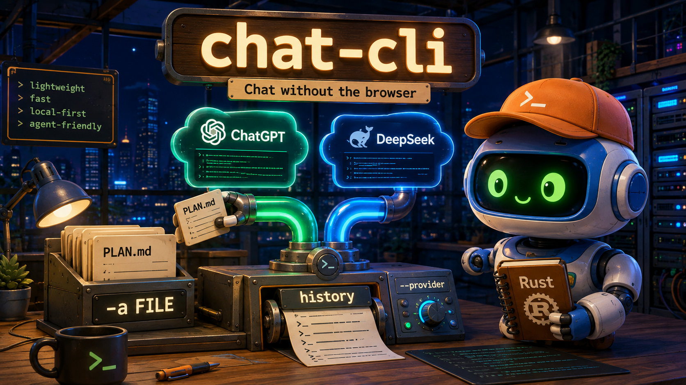

# chat-cli — ChatGPT & DeepSeek, without the browser

<div align="center">
  
</div>

<div align="center">


</div>

**Stop copying plans into a browser tab. Let your agent talk to ChatGPT directly.**

`chat-cli` brings ChatGPT and DeepSeek web sessions to the terminal — so your 3 a.m. plan-review loop becomes a single piped command instead of a copy-paste ritual.

<p align="center">
  <em>rust cli · chatgpt · claude · deepseek · gemini · llm · terminal · ai-agent · multi-provider · headless</em>
</p>

<div align="center">

```bash
cargo install --path crates/chat-cli
chat-cli auth login chatgpt          # paste session token once, then forget it
chat-cli -p "tear this plan apart" -a ./PLAN.md --provider chatgpt
```

</div>

> **Origin:** You were iterating on plans by hand-feeding them to ChatGPT in a browser. `chat-cli` removes that bottleneck: `chat-cli -p "..." --provider chatgpt` with ` -a` file attachments, local history, and a `crates/*` provider architecture — now shipping ChatGPT, Claude, DeepSeek and Gemini — all direct **web** providers (paste a cookie once, no paid API) — behind the same `Provider` trait.

---

## Why chat-cli?

### The problem (real pain, operator language)

- You have a `PLAN.md` on disk. To get ChatGPT's opinion you open a tab, paste, wait, copy back, and repeat.
- Your coding agent can't do that for you — it would need to drive a browser, pass CAPTCHAs, and babysit tokens.
- Switching between ChatGPT, DeepSeek, and others means switching tabs, contexts, and file-upload flows.
- History lives in the browser; your next prompt has no memory of the previous review unless you re-paste everything.

### The solution

`chat-cli` authenticates against the same web endpoints the browser uses, streams the answer to `stdout`, and stores history locally — so both humans and agents can call it like any other CLI.

### Why chat-cli over…

| Capability | `chat-cli` | ChatGPT web | OpenAI / Codex CLI |
|---|---:|---|---:|
| One-command plan review (`-a ./PLAN.md`) | ✅ ` -a` + glob + `@list` + stdin | ❌ manual upload + paste | ⚠️ shares ChatGPT quota, but OpenAI-only — no multi-provider |
| Works for agents (non-interactive, no browser) | ✅ `--token` + pipeable `stdout` | ❌ needs a headed browser | ✅ shares ChatGPT quota, headless — but OpenAI-only |
| Local history you can list, branch, and grep | ✅ `history list/show/rm`, `--new` / `--continue <id>` | ⚠️ browser sidebar only | ❌ server-side only |
| Provider switch without touching core | ✅ `crates/provider-*` + `Provider` trait + inventory registry | ❌ N/A | ❌ one backend |
| Token that feels permanent | ✅ manual paste once, rolling 30-day refresh | ⚠️ automatic but browser-bound | ✅ shared ChatGPT session (same quota) |
| File context that survives provider differences | ✅ `prepare_attachments()` overridable per provider | ❌ per-site upload quirks | ⚠️ OpenAI file tool only |

---

## Quick example

```bash
# Auth once (ChatGPT): DevTools → Application → Cookies → copy
# __Secure-next-auth.session-token, then paste (hidden input)
chat-cli auth login chatgpt
chat-cli auth status

# DeepSeek too
chat-cli auth login deepseek
chat-cli auth status

# Default provider is the first login (stored in ~/.config/chat-cli/config.toml)
chat-cli config set default_provider deepseek
chat-cli config get default_provider

# Prompt: positional or -p, alias of the same thing
chat-cli "review this plan, be harsh" -a ./PLAN.md --provider chatgpt
chat-cli -p "same thing"           # same as above when default_provider=chatgpt
cat PLAN.md | chat-cli -p "review stdin"    # stdin becomes an attachment when -a is empty

# File attachments — four equivalent ways
chat-cli -p "compare" -a a.md -a b.md              # repeat flag
chat-cli -p "compare" -a a.md,b.md                 # comma-separated
chat-cli -p "compare" -a "src/**/*.rs"             # glob
chat-cli -p "compare" -a @filelist.txt             # line-delimited list file

# System prompt
chat-cli -p "review" -a PLAN.md -s "You are a harsh plan reviewer."

# Conversations: new vs continue
chat-cli -p "fresh thread" --new
chat-cli -p "follow up" --continue          # most recent history for this provider
chat-cli -p "follow up" --continue a1b2c3d4 # explicit id
chat-cli --provider deepseek -p "same idea, different backend"

# History (local, not server — fast and grep-able)
chat-cli history list
chat-cli history list --provider chatgpt --limit 20
chat-cli history show a1b2c3d4
chat-cli history rm a1b2c3d4

# Verbose + config override
chat-cli -v --config /tmp/my.toml -p "debug this"
```

---

## Design principles

| Principle | How it shows up |
|---|---|
| Provider is an extension, not a fork | `crates/chat-core/src/provider.rs` defines `trait Provider`; each backend is `crates/provider-*` and self-registers via `inventory`. The Gemini and Claude providers landed exactly this way, and the next backend follows the same recipe — no core edit. |
| Attachments travel with the request, not the browser | `crates/chat-core/src/attach.rs` resolves `-a` into `Vec<PathBuf>` then `prepare_attachments()` injects `<<<FILE: path>>>` fences by default; a provider can override to do real `/backend-api/files` upload. |
| Budget fails loud, never silently truncates | `crates/chat-core/src/budget.rs` checks `system + history + attachments + prompt` against `context_limit()` and prints a per-segment breakdown so the agent can decide what to cut. |
| History is local and honest | `crates/chat-core/src/history.rs` is append-only `~/.local/share/chat-cli/history/<id>.jsonl` with `provider_conversation_id` + `provider_parent_message_id` stored explicitly. Cross-provider `--continue` is rejected with a clear error. |
| Auth is paste-once, then rolling | `crates/chat-core/src/config.rs` stores `~/.config/chat-cli/config.toml` (`0600`, atomic `write+rename`) with `default_provider` as source of truth. First login sets the default; later logins don't override it. |
| Browser fidelity without a browser | `crates/provider-chatgpt` does a rolling `GET /api/auth/session` refresh, asks `/backend-api/sentinel/chat-requirements`, and posts `/backend-api/conversation` with SSE parsing — same endpoints the browser hits, no headed browser required. The DeepSeekHashV1 PoW solver lives in `crates/deepseek-pow`, shared by both providers. |

---

## Installation

### One-liner (recommended)

```bash
# macOS / Linux
curl -fsSL "https://raw.githubusercontent.com/quangdang46/chat-cli/main/install.sh?$(date +%s)" | bash
```

```powershell
# Windows PowerShell
irm "https://raw.githubusercontent.com/quangdang46/chat-cli/main/install.ps1" | iex
```

Installer flags: `--easy-mode` (auto PATH), `--verify`, `--from-source`,
`--dest <dir>`, `--version vX.Y.Z`, `--uninstall`. Prebuilt binaries for
linux-x86_64, linux-aarch64, macos-x86_64, macos-aarch64, windows-x86_64
are attached to every GitHub Release with sha256 sidecars.

### From source

| Method | Command |
|---|---|
| From source (recommended) | `cargo build --release -p chat-cli && cp target/release/chat-cli ~/.local/bin/` |
| Workspace build | `cargo build --release` (builds all crates) |
| Per-crate | `cargo install --path crates/chat-cli` |

Requirements: Rust stable, `~/.local/bin` on `PATH` if you use `cargo install`.

---

Config lives at `~/.config/chat-cli/config.toml` (`0600`, atomic write). Override per invocation with `--config <path>`.

```toml
# Source of truth for default_provider — not inferred from login order
default_provider = "chatgpt"

[providers.chatgpt]
session_token = "paste-once, validated via GET /api/auth/session"
access_token = "cached, refreshed on rolling window"
access_token_expiry = "2026-08-21T00:00:00Z"

[providers.deepseek]
session_token = "..."

# Claude web (direct — sessionKey cookie from claude.ai)
[providers.claude]
session_token = "sk-ant-sid01-..."
model = "claude-sonnet-4-6"                     # optional; "-thinking" suffix enables extended thinking


# Gemini web (reverse-engineered; cookies from gemini.google.com)
[providers.gemini]
session_token = "__Secure-1PSID value"
access_token = "__Secure-1PSIDTS value (rolling)"
model = "gemini-flash"                          # optional; defaults to account default
```

```bash
chat-cli config set default_provider deepseek   # change default
chat-cli config get default_provider            # inspect it
chat-cli --config /tmp/ci.toml -p "use ephemeral config"
```

---

## Commands

### `chat-cli auth`

```bash
chat-cli auth login chatgpt                 # interactive — prints a DevTools console snippet first
chat-cli auth login deepseek --token "..."  # non-interactive (for agents)
chat-cli auth login chatgpt --token "..." --default   # also set as default_provider
chat-cli auth default deepseek              # switch default_provider anytime
chat-cli auth status                        # logged-in providers + expiry
chat-cli auth logout chatgpt
```

**Per-provider notes**

- **claude** — same cookie-paste flow as ChatGPT: copy the `sessionKey` cookie
  (DevTools → Application → Cookies → claude.ai; it is HttpOnly so the console
  cannot read it) and run:
  ```bash
  chat-cli auth login claude --token "sk-ant-sid01-..."
  ```
  Validated live against `GET /api/account`; the org uuid is resolved per turn.

- **gemini** — accepts a bare `__Secure-1PSID` value, both values separated by `;`, or a full cookie paste; `__Secure-1PSIDTS` is stored as the rolling cookie and refreshed automatically when Google rotates it.

**Fast token capture** — `auth login` prints a ready-made console one-liner before
prompting. Paste it into the provider site's DevTools console and the token lands
in your clipboard, no panel-hunting:

```js
// chatgpt.com → DevTools Console:
copy(document.cookie.split('; ').find(c => c.startsWith('__Secure-next-auth.session-token=')).split('=')[1])

// chat.deepseek.com → DevTools Console:
copy(JSON.parse(localStorage.getItem('userToken')).value)
```

Gemini's cookies are `HttpOnly`, so the console cannot read them — `auth login gemini`
prints panel instructions (DevTools → Application → Cookies → `gemini.google.com`)
instead of a one-liner.

Validation on `login`: the CLI immediately validates against the live endpoint
(`GET /api/auth/session` for ChatGPT, session probe for DeepSeek, an `SNlM0e`
check for Gemini) and reports success/failure — a bad
paste is caught before it becomes a silent failure later.
`default_provider` semantics: first login sets it; later logins keep it unless you
pass `--default` or run `chat-cli auth default <provider>`.

### `chat-cli` (chat)

```bash
chat-cli -p "prompt" [--provider chatgpt|claude|deepseek|gemini] [-s "system"] [-a FILE ...] [--model m] [--new|--continue[ <id>]]
chat-cli "prompt"                            # positional alias for -p
chat-cli --provider deepseek -p "..."        # override default
chat-cli -p "..." -s "You are a reviewer."   # system prompt
chat-cli --provider claude --model claude-sonnet-4-6-thinking -p "..."
```

Flags:
- `-a` repeatable, plus comma/glob/`@list.txt` and implicit `stdin`.
- `--model` overrides `[providers.<id>].model` for this turn (e.g. `-thinking` on claude enables extended thinking without editing config).
- `--new` forces a fresh local history file; `--continue` resumes, defaulting to the most recent history for the selected provider. A provider mismatch is a hard error (a ChatGPT `conversation_id` is meaningless to DeepSeek and vice versa).

### `chat-cli history`

```bash
chat-cli history list [--provider chatgpt] [--limit 20]
chat-cli history show <id>
chat-cli history rm <id>
```

Local only (`~/.local/share/chat-cli/history/<id>.jsonl`), so `list` is instant and offline.

### Global flags

```bash
--provider <name>   # per-invocation override, highest priority
--config <path>     # ephemeral config (CI, tests)
-v / --verbose      # extra diagnostics on stderr
```

Resolution order for the provider on every chat: `--provider` flag → `config.toml:default_provider` → clear error (`Run 'chat-cli auth login <provider>' first.`).

---

## Architecture

```
chat-cli  (crates/chat-cli)
  cli.rs        — clap surface: auth / history / chat flags
  dispatch.rs   — provider resolve → attach → budget → history → chat
       │
chat-core (crates/chat-core)        ← knows no concrete provider
  provider.rs   — trait Provider + inventory registry (Strategy + Registry + DI)
  config.rs     — config.toml (0600, default_provider source of truth)
  history.rs    — HistoryFile { id, provider, provider_conversation_id, provider_parent_message_id, turns }
  attach.rs     — -a resolution (repeat/comma/glob/@list/stdin) + size guards
  budget.rs     — fail-fast with breakdown vs context_limit()
       │
provider-chatgpt (crates/provider-chatgpt)    provider-deepseek (crates/provider-deepseek)
  protocol.rs   — /api/auth/session, sentinel,   protocol.rs  — chat.deepseek.com/api/v0/*
                 chat-requirements, conversation
  lib.rs        — rolling session refresh,        lib.rs       — fetch_page probe, session create,
                 conversation POST + SSE parse                PoW, completion stream parse

provider-claude (crates/provider-claude)
  protocol.rs   — anthropic-client headers, completion payload, SSE parser
                  (text/thinking deltas, repl/artifacts code-fence rebuild)
  lib.rs        — /api/account org lookup, conversation create/continue,
                  extended-thinking (paprika_mode) toggle, completion stream


provider-gemini (crates/provider-gemini)
  protocol.rs   — /app bootstrap extraction, 81-slot f.req builder, length-prefixed
                  frame parser (UTF-16 units), candidate/error extraction
  lib.rs        — 1PSID/1PSIDTS cookie auth, StreamGenerate turn, rolling 1PSIDTS persist
       │
deepseek-pow (crates/deepseek-pow) — Keccak-f[1600] rounds 1..23 solver
  shared by both providers (DeepSeekHashV1 challenge format)
```

Add a new backend without touching core:

```bash
cargo new crates/provider-gemini --lib
# impl Provider for GeminiProvider { ... }
# inventory::submit!(ProviderEntry { id: "gemini", factory: || Box::new(GeminiProvider) });
```

---

## Troubleshooting

| Symptom | Cause | Fix |
|---|---:|---|
| `No provider specified and no default_provider set` | No `--provider` flag and no `default_provider` in config | `chat-cli auth login chatgpt` (first login sets default) or `chat-cli config set default_provider chatgpt` |
| `history 'abc' was created with provider 'chatgpt', cannot continue with '--provider deepseek'` | Cross-provider `--continue` | Use `--new` or `--continue` with a history from the same provider; `history list --provider deepseek` to find the right id |
| `glob pattern '...' matched no files` | No file matched the `-a` glob | Check the pattern from the repo root, or use `-a @filelist.txt` |
| `chatgpt requested a proof-of-work this build cannot solve yet` | ChatGPT demanded a sentinel PoW variant beyond the shared DeepSeekHashV1 solver | Retry (most turns don't require it), or fall back to `--provider deepseek` |
| `429 rate-limited by chatgpt/deepseek` | Provider rate limit hit | Wait and retry, or switch providers with `--provider` |
| `no assistant response found in conversation stream` / `no content found in deepseek completion stream` | Model refused, account flagged, or session expired mid-chat | Re-run `auth login`, try `--new`, or check the provider's web app |
| `file '...' too large` / `total attachments too large` | Per-file 1 MB / total 5 MB guard | Split the file or pass fewer attachments |
| `context limit ... exceeded: system=... history=... attachments=... prompt=...` | Combined input exceeds provider limit | Drop attachments, use `--new`, or shorten history; the breakdown tells you which segment to cut |
| `auth login` reports invalid | Pasted token is wrong or the browser cookie name is different | ChatGPT: copy `__Secure-next-auth.session-token` exactly (DevTools → Application → Cookies); DeepSeek: copy the session token, then re-run with `--token`; Gemini: re-copy `__Secure-1PSID` + `__Secure-1PSIDTS` (the 1PSIDTS value expires quickly) |
| `sessionKey rejected by claude.ai` / completion 401 | Claude web session expired or copied wrong | Re-copy the `sessionKey` cookie (DevTools → Application → Cookies) and re-run `auth login claude` |
| `429 from claude.ai — usage limit` | Claude web quota window exhausted | Wait for the window to reset, or switch `--provider gemini` |
| `init page carried no SNlM0e token` (gemini) | Cookies expired, region-blocked, or a guest page was served | Re-run `auth login gemini` with fresh cookies; try a proxy if your region blocks Gemini |
| `usage limit exceeded` / `model header invalid` (gemini) | Account quota hit, or the static model table is stale | Switch `--model gemini-flash`, drop the model setting, or wait for the quota window |

---

## Limitations

- ChatGPT auth is web-session based (manual cookie paste, rolling ~30-day window). A password change, "log out all devices," or server-side rotation invalidates the session and requires a fresh paste — the CLI re-validates via `GET /api/auth/session` so you find out immediately.
- ChatGPT sentinel PoW is solved locally; Cloudflare Turnstile challenges beyond PoW are not handled.
- History is local (`~/.local/share/chat-cli/history`). `history list` does not call the server-side `GET /backend-api/conversations` — that keeps it fast and offline, but a conversation created in the browser won't appear until the CLI creates it.
- Budget check is byte/character-based in the POC; a token-aware estimator can replace it later without changing the trait.
- Claude web: the `-thinking` model suffix flips the **account-level** extended-thinking setting (`paprika_mode`), the same switch the web UI uses — it is account-wide, not per-conversation. The `anthropic-client-sha` header tracks the web frontend and may need a bump when claude.ai ships a new build. claude.ai sits behind Cloudflare; if TLS fingerprinting starts blocking plain HTTP clients, the HTTP stack may need to switch to a browser-impersonating one (`rquest`) — same risk as Gemini.
- Gemini web protocol is reverse-engineered and Google can change it without notice (field indices, frame format, bot checks). Error messages carry the raw error codes so breakage is diagnosable; if Google starts TLS-fingerprinting clients, the HTTP stack may need to switch to a browser-impersonating one (`rquest`).

---

## FAQ

**Why not just use the ChatGPT browser tab?**
The tab is fine for one-off questions. For an agent that needs to call `chat-cli -p "review PLAN.md" -a PLAN.md --provider chatgpt` a hundred times, a browser is a liability: it needs a window, a human, and manual file uploads. `chat-cli` does it headless and pipeably.

**Why not just use Codex / the OpenAI API?**
Codex already shares your ChatGPT quota (same web-session billing, not a separate API key bill), so quota isn't the differentiator — **breadth is**. Codex is OpenAI-only. `chat-cli` is multi-provider by design — ChatGPT, Claude, DeepSeek and Gemini web, all driven the way their browser clients are — behind the same `Provider` trait + `crates/provider-*` layout, so you can switch backends without rewriting core.

**How does Claude work — and where does claude2api fit?**
Claude is a **direct web provider**, same philosophy as ChatGPT: paste the `sessionKey` cookie once, and chat-cli speaks the same endpoints the claude.ai web app does (`/api/account` for the org, `.../chat_conversations` create, `.../completion` SSE stream — including extended thinking via the account's `paprika_mode` setting and `--model claude-sonnet-4-6-thinking`). The protocol was mirrored from the MIT-licensed [claude2api](https://github.com/basketikun/claude2api) gateway, whose `internal/service` is itself a claude.ai web client; no code was copied, and no gateway needs to run.

```bash
chat-cli auth login claude --token "sk-ant-sid01-..."
chat-cli --provider claude -p "hello Claude"
chat-cli --provider claude --model claude-sonnet-4-6-thinking -p "think hard"
```


**How do I add a new provider?**
Create `crates/provider-<name>`, implement `Provider { id, context_limit, auth, chat, prepare_attachments }`, and `inventory::submit!` it. `chat-core` and existing providers are unchanged — the architecture is deliberately open-closed.

**How is the browser session kept alive?**
The CLI stores the pasted `session_token` in `config.toml` and, before each chat, does the same rolling refresh the browser does: `GET /api/auth/session` → cache the short-lived `access_token` → persist any new `Set-Cookie` value. There is no background daemon; the next chat does the refresh.

**Can an agent drive this without a TTY?**
Yes. `chat-cli auth login chatgpt --token "..."` is fully non-interactive, `stdin` is treated as an attachment when `-a` is empty, and all diagnostics go to `stderr` so `stdout` stays clean for piping.

**How do I add Gemini as a provider?**
It's built in now — `chat-cli auth login gemini` (paste `__Secure-1PSID` + `__Secure-1PSIDTS` from DevTools → Application → Cookies). The implementation is a clean-room Rust port of the `gemini_webapi` protocol (that reference is AGPL-3.0; no code was copied, so chat-cli stays MIT).

---

## Development

```bash
cargo build                          # all crates
cargo test --workspace               # core + providers + cli (offline, mocked)
cargo run -p chat-cli -- --help      # inspect the surface
```

Protocol constants were verified against live Chrome DevTools captures of the ChatGPT sentinel and conversation endpoints.